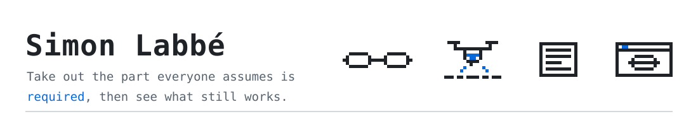
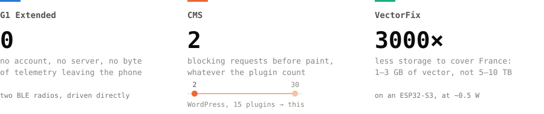
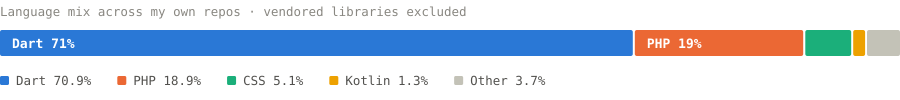

<picture>
  <source media="(prefers-color-scheme: dark)" srcset="banner-dark.svg">
  
</picture>

France · [simonlabbe.fr](https://simonlabbe.fr) · contact@simonlabbe.fr

**On paper I do marketing and communication** — BUT MMI, currently at ADN Technologies.
In practice I spend my evenings on a reverse-engineered BLE protocol and a CMS with no
database. I have found that the two jobs are the same one: figure out what a thing is
really for, cut everything that is only there out of habit, and say plainly what is
left. It just happens in a different file format.

---

### Three projects, one habit

Each one removes the piece everyone treats as non-negotiable, then asks what is
actually left to build.

<picture>
  <source media="(prefers-color-scheme: dark)" srcset="stats-dark.svg">
  
</picture>

---

### What I'm building

**[G1 Extended](https://github.com/LabbeSimon/G1_Extended)** — an open-source Android
client for [Even Realities G1](https://www.evenrealities.com) smart glasses, written
against a reverse-engineered BLE protocol: two Nordic UART radios, one per temple.
HUD layouts the official app never exposes, hardware events it throws away, and a path
for your own microcontroller to push lines to the lens. No account, no telemetry,
nothing leaves the phone.
 Dart · Flutter · C · BLE — [docs](https://simonlabbe.fr/g1) · [releases](https://github.com/LabbeSimon/G1_Extended/releases)

**[CMS](https://github.com/LabbeSimon/CMS)** — a PHP CMS for the sites nobody writes
software for: town halls, associations, schools, small practices. Pages, accounts and
config are files, so there is no database to install and no root access to ask for.
The core merges every plugin's CSS and JS into one file each, in an order the plugins
declare themselves — fifteen plugins still cost two blocking requests instead of thirty.
 PHP · zero-dependency · file storage

**VectorFix** *(private · pre-alpha)* — absolute visual localisation for UAVs in
GNSS-denied conditions, matching a nadir camera against **vector map data** rather than
imagery. France in 1–3 GB instead of 5–10 TB, cold start with no position prior,
targeting an ESP32-S3 at roughly half a watt. The core hypothesis is not validated yet,
and the README says so.
 C · ESP-IDF · computer vision

---

### What I write it in

<picture>
  <source media="(prefers-color-scheme: dark)" srcset="langs-dark.svg">
  
</picture>

Rebuilt every Monday from the GitHub API by
<a href="https://github.com/LabbeSimon/LabbeSimon/blob/main/.github/workflows/refresh-charts.yml">a workflow in this repo</a>,
and served from it — no third-party card service standing between this page and you.
Vendored libraries are excluded, so the bar counts code I actually wrote.

---

### How I work

Plain READMEs that state what fails as clearly as what works — the VectorFix one opens
with *"the core hypothesis is not yet validated"*, because that is the useful sentence.
Commit messages in the present tense that say what changed and why. A preference for the
version with fewer moving parts, even when it costs more work up front.

The rest of the toolbox: SEO, brand and campaign work, video production and interviews
for the IUT Troyes Web TV, and enough English to ship documentation in it.

Open to talk — **contact@simonlabbe.fr**
